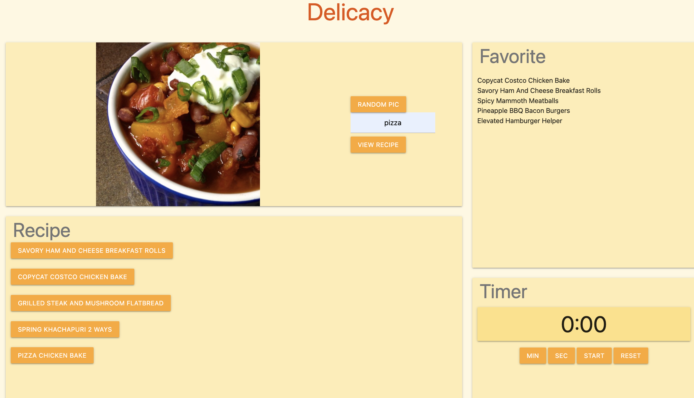

# delicacy

As a human, beautiful food pictures could both soothe our stomachs and soul. Also, we all facing the awkward situation that we don't know what to eat and cook standing in front of the refrigerators. A good and detailed recipe helps a lot. When we find some good recipe, we definitely would like to save it for the future and someone important in our life. 

We use spoonacular API to find excellent pictures and Tasty API to find recipes. A well-organized page using materialize helps give us an attractive presentation.

Excellent food pictures section gives the user some sparks about what to eat.

When we are interested, they could search for the recipes and get different methods of cooking from VIEW RECIPE.

In the Recipe part, when we click the cooking method, we will get a detailed recipe. 

When we are very interested in the Recipe. We would like to come back and cook again for our family and friends. We could press the FAVORITE button for the future reference. 

When we refer to the Favorite section, it will show the recipe we are interested in and may have tried. We may know which part we could improve. 

## Mock-Up

The following image shows the web application's appearance and functionality:

Deployed https://kayjinyi.github.io/delicacy/
